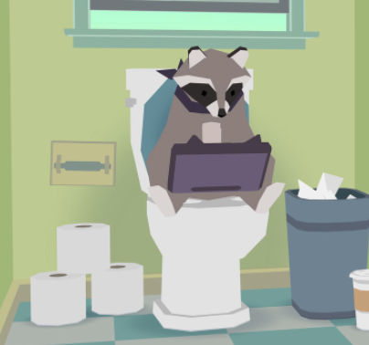

# Trash Panda Bot

<div id="top"></div>
<!--
*** Thanks for checking out the Best-README-Template. If you have a suggestion
*** that would make this better, please fork the repo and create a pull request
*** or simply open an issue with the tag "enhancement".
*** Don't forget to give the project a star!
*** Thanks again! Now go create something AMAZING! :D
-->

<!-- PROJECT SHIELDS -->
<!--
*** I'm using markdown "reference style" links for readability.
*** Reference links are enclosed in brackets [ ] instead of parentheses ( ).
*** See the bottom of this document for the declaration of the reference variables
*** for contributors-url, forks-url, etc. This is an optional, concise syntax you may use.
*** https://www.markdownguide.org/basic-syntax/#reference-style-links
-->
[![Contributors][contributors-shield]][contributors-url]
[![Forks][forks-shield]][forks-url]
[![Stargazers][stars-shield]][stars-url]
[![Issues][issues-shield]][issues-url]
[![MIT License][license-shield]][license-url]
[![LinkedIn][linkedin-shield]][linkedin-url]

<!-- PROJECT LOGO -->
<br />
<div align="center">
  <a href="https://github.com/jamestkelly/trash-panda-bot">
    
  </a>

<h3 align="center">Trash Panda Bot</h3>

  <p align="center">
    A little trash panda to randomly post in your Discord server.
    <br />
    <a href="https://github.com/jamestkelly/trash-panda-bot"><strong>Explore the docs »</strong></a>
    <br />
    ·
    <a href="https://github.com/jamestkelly/trash-panda-bot/issues">Report Bug</a>
    ·
    <a href="https://github.com/jamestkelly/trash-panda-bot/issues">Request Feature</a>
  </p>
</div>

<!-- TABLE OF CONTENTS -->
<details>
  <summary>Table of Contents</summary>
  <ol>
    <li>
      <a href="#about-the-project">About The Project</a>
      <ul>
        <li><a href="#built-with">Built With</a></li>
      </ul>
    </li>
    <li>
      <a href="#getting-started">Getting Started</a>
      <ul>
        <li><a href="#prerequisites">Prerequisites</a></li>
        <li><a href="#installation">Installation</a></li>
      </ul>
    </li>
    <li><a href="#usage">Usage</a></li>
    <li><a href="#roadmap">Roadmap</a></li>
    <li><a href="#contributing">Contributing</a></li>
    <li><a href="#license">License</a></li>
    <li><a href="#contact">Contact</a></li>
    <li><a href="#acknowledgments">Acknowledgments</a></li>
  </ol>
</details>

<!-- ABOUT THE PROJECT -->
## About The Project

Here's a blank template to get started: To avoid retyping too much info. Do a search and replace with your text editor for the following: `github_username`, `repo_name`, `twitter_handle`, `linkedin_username`, `email_client`, `email`, `project_title`, `project_description`

<p align="right">(<a href="#top">back to top</a>)</p>

### Built With

* [NodeJS](https://nodejs.org/en/)
* [Discord API](www.discord.com)

<p align="right">(<a href="#top">back to top</a>)</p>

<!-- GETTING STARTED -->
## Getting Started

### Prerequisites

Discord bot, `trash-panda-bot` is build using NodeJS and the Discord API, as such it is assumed that you already have Node installed in your local environment. To install the required packages, using the following command.

* npm

  ```sh
  npm install
  ```

### Installation

1. Follow the [instructions](https://discord.com/developers/docs/intro) from Discord to generate a free token.
2. Clone the repo

   ```sh
   git clone https://github.com/jamestkelly/trash-panda-bot.git
   ```

3. Install NPM packages

   ```sh
   npm install
   ```

4. Create a file called `config.json` and add your token to it.
   
   ```json
   {
     "BOT_TOKEN": "EXAMPLE0123adhgajksdcTOKEN"
   }
   ```

5. Run the bot locally to test if it works prior to deployment.
   
   ```sh
   node index.js # Run the bot on your local host
   ```

<p align="right">(<a href="#top">back to top</a>)</p>

<!-- USAGE EXAMPLES -->
## Usage

This project can be used within your own Discord servers by connecting them and adding the `bot` to any given channel. To edit questions, simply edit the `questions.txt` file to change which questions the bot will select from _at random_ to ask people within your server.

_For more examples, please refer to the [Documentation](https://example.com)_

<p align="right">(<a href="#top">back to top</a>)</p>

<!-- ROADMAP -->
## Roadmap

* [ ] Develop `trash-panda-bot` in its most basic form, i.e. ability to read and write to a channel.
* [ ] Write up several _funny_ and unrealistic things for the bot to post.
* [ ] Finalise `Version 1.0` of the bot.
  * [ ] Release the bot.

See the [open issues](https://github.com/jamestkelly/trash-panda-bot/issues) for a full list of proposed features (and known issues).

<p align="right">(<a href="#top">back to top</a>)</p>

<!-- CONTRIBUTING -->
## Contributing

Contributions are what make the open source community such an amazing place to learn, inspire, and create. Any contributions you make are **greatly appreciated**.

If you have a suggestion that would make this better, please fork the repo and create a pull request. You can also simply open an issue with the tag "enhancement".
Don't forget to give the project a star! Thanks again!

1. Fork the Project
2. Create your Feature Branch (`git checkout -b feature/AmazingFeature`)
3. Commit your Changes (`git commit -m 'Add some AmazingFeature'`)
4. Push to the Branch (`git push origin feature/AmazingFeature`)
5. Open a Pull Request

<p align="right">(<a href="#top">back to top</a>)</p>

<!-- LICENSE -->
## License

Distributed under the MIT License. See `LICENSE` for more information.

<p align="right">(<a href="#top">back to top</a>)</p>

<!-- CONTACT -->
## Contact

Jim Kelly - jimkelly.t@outlook.com

Project Link: [https://github.com/jamestkelly/trash-panda-bot](https://github.com/jamestkelly/trash-panda-bot)

<p align="right">(<a href="#top">back to top</a>)</p>

<!-- ACKNOWLEDGMENTS -->
## Acknowledgments

### Notable Contributors

* [Aaron Dougals](https://www.linkedin.com/in/aaron-douglas-28645a23b/)
* [Jimmy Hoang](https://www.linkedin.com/in/jimmy-hoang-5270b8238/)
* [Rohan Singh](https://www.linkedin.com/in/rohan-singh-developer/)

### Service Providers

* [Discord](https://discord.com)

<p align="right">(<a href="#top">back to top</a>)</p>

<!-- MARKDOWN LINKS & IMAGES -->
<!-- https://www.markdownguide.org/basic-syntax/#reference-style-links -->
[contributors-shield]: https://img.shields.io/github/contributors/jamestkelly/trash-panda-bot.svg?style=for-the-badge
[contributors-url]: https://github.com/jamestkelly/trash-panda-bot/graphs/contributors
[forks-shield]: https://img.shields.io/github/forks/jamestkelly/trash-panda-bot.svg?style=for-the-badge
[forks-url]: https://github.com/jamestkelly/trash-panda-bot/network/members
[stars-shield]: https://img.shields.io/github/stars/jamestkelly/trash-panda-bot.svg?style=for-the-badge
[stars-url]: https://github.com/jamestkelly/trash-panda-bot/stargazers
[issues-shield]: https://img.shields.io/github/issues/jamestkelly/trash-panda-bot.svg?style=for-the-badge
[issues-url]: https://github.com/jamestkelly/trash-panda-bot/issues
[license-shield]: https://img.shields.io/github/license/jamestkelly/trash-panda-bot.svg?style=for-the-badge
[license-url]: https://github.com/jamestkelly/trash-panda-bot/blob/master/LICENSE.txt
[linkedin-shield]: https://img.shields.io/badge/-LinkedIn-black.svg?style=for-the-badge&logo=linkedin&colorB=555
[linkedin-url]: https://linkedin.com/in/jimkellyt
